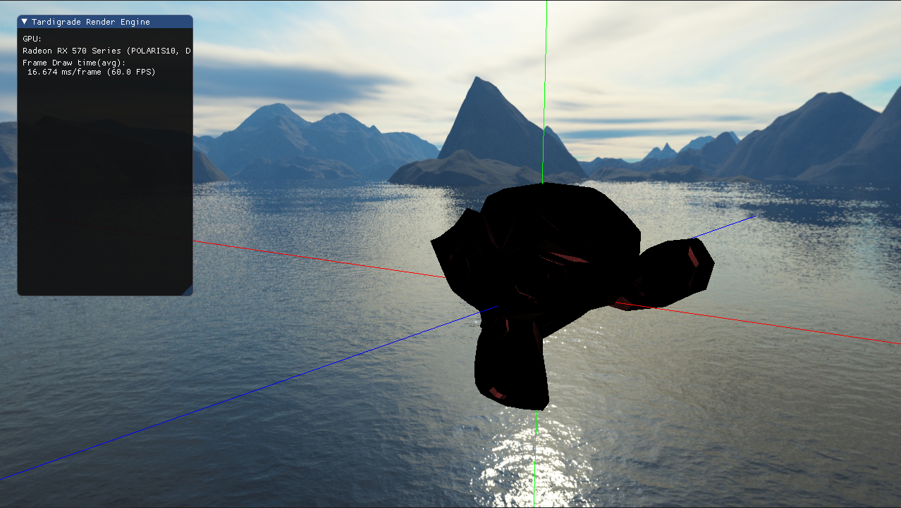

# Render Engine

Simple Render Engine Project. This is a work in progress...

Following the tutorials found at https://learnopengl.com/

### Screenshots

### Things to do
- Fix bug in screenshot feature
- Add UI to load models
- Update controls
- Add a plethora of other graphics things (SSAO, HBAO, VXAO, bloom, shadows, lighting)